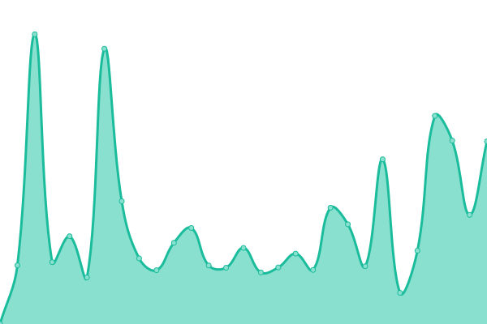
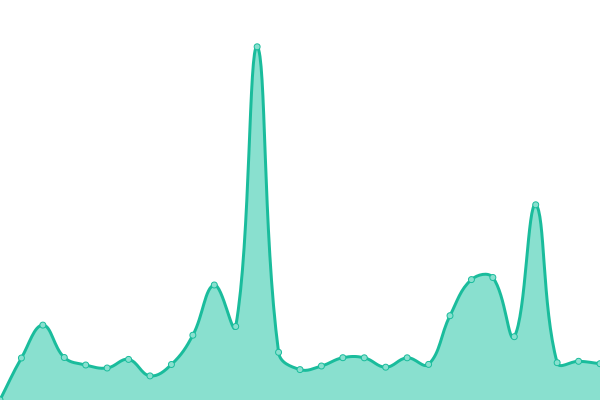
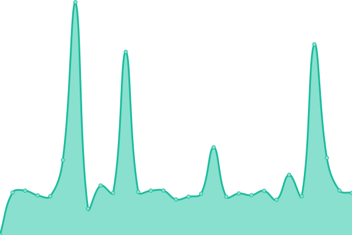
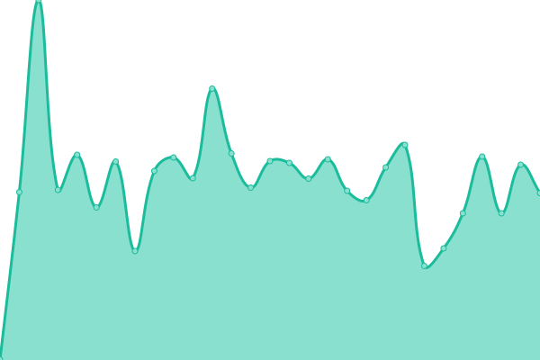
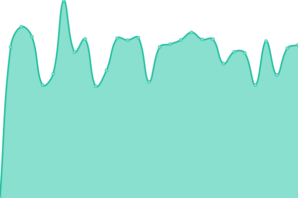
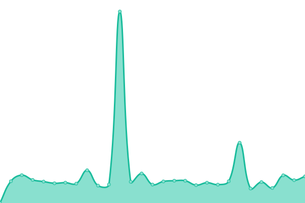
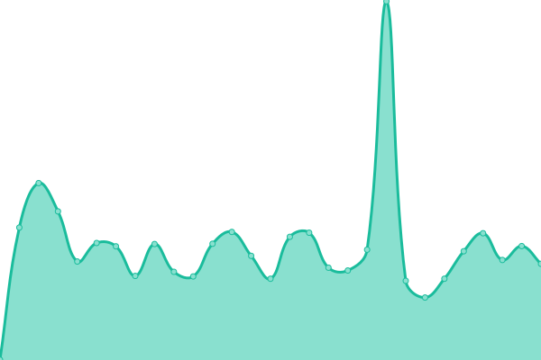
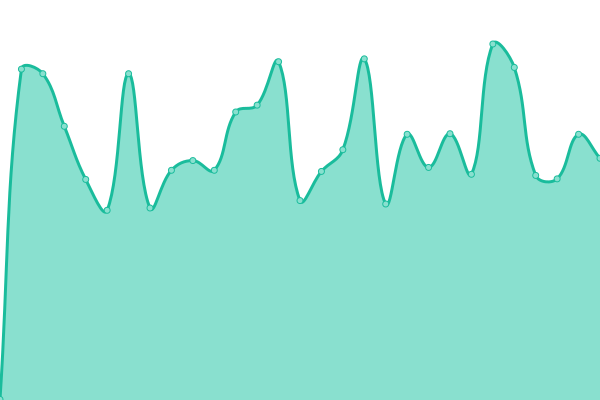

# [📈 Estatus en Tiempo Real](https://censecar.github.io/estatus): <!--live status--> **Todos los sistemas están operativos**

This repository contains the open-source uptime monitor and status page for [CenSeCar](https://censecar.github.io/estatus), powered by [Upptime](https://github.com/upptime/upptime).

With [Upptime](https://upptime.js.org), you can get your own unlimited and free uptime monitor and status page, powered entirely by a GitHub repository. We use [Issues](https://github.com/censecar/estatus/issues) as incident reports, [Actions](https://github.com/censecar/estatus/actions) as uptime monitors, and [Pages](https://censecar.github.io/estatus) for the status page.

## [📈 Live Status](https://demo.upptime.js.org): <!--live status--> **Todos los sistemas están operativos**

<!--start: status pages-->
<!-- This summary is generated by Upptime (https://github.com/upptime/upptime) -->
<!-- Do not edit this manually, your changes will be overwritten -->
<!-- prettier-ignore -->
| URL | Status | History | Response Time | Uptime |
| --- | ------ | ------- | ------------- | ------ |
|  [Pagina Principal (Web)](https://www.censecar.com.mx) | En línea | [pagina-principal-web.yml](https://github.com/censecar/estatus/commits/HEAD/history/pagina-principal-web.yml) | 

 956ms
     
 | 

<a href="https://censecar.github.io/estatus/history/pagina-principal-web">100.00%</a>
    

|  [SIMA (MANIFIESTOS)](http://200.12.125.74) | En línea | [sima-manifiestos.yml](https://github.com/censecar/estatus/commits/HEAD/history/sima-manifiestos.yml) | 

 592ms
     
 | 

<a href="https://censecar.github.io/estatus/history/sima-manifiestos">100.00%</a>
    

|  [SAAIT (FIANZAS)](http://200.12.125.73/Login) | En línea | [saait-fianzas.yml](https://github.com/censecar/estatus/commits/HEAD/history/saait-fianzas.yml) | 

 274ms
     
 | 

<a href="https://censecar.github.io/estatus/history/saait-fianzas">100.00%</a>
    

|  [SAAIT v2.0 (FIANZAS)](http://200.12.125.76/Login) | En línea | [saait-v2-0-fianzas.yml](https://github.com/censecar/estatus/commits/HEAD/history/saait-v2-0-fianzas.yml) | 

 158ms
     
 | 

<a href="https://censecar.github.io/estatus/history/saait-v2-0-fianzas">100.00%</a>
    

|  [Manifiestos (NUEVO)](https://manifiestos.censecar.com.mx) | En línea | [manifiestos-nuevo.yml](https://github.com/censecar/estatus/commits/HEAD/history/manifiestos-nuevo.yml) | 

 375ms
     
 | 

<a href="https://censecar.github.io/estatus/history/manifiestos-nuevo">99.40%</a>
    

|  [Contrato Digital (CARTA PORTE)](https://contratodigital.online) | En línea | [contrato-digital-carta-porte.yml](https://github.com/censecar/estatus/commits/HEAD/history/contrato-digital-carta-porte.yml) | 

 835ms
     
 | 

<a href="https://censecar.github.io/estatus/history/contrato-digital-carta-porte">100.00%</a>
    

|  API CenSeCar | En línea | [api-cen-se-car.yml](https://github.com/censecar/estatus/commits/HEAD/history/api-cen-se-car.yml) | 

 454ms
     
 | 

<a href="https://censecar.github.io/estatus/history/api-cen-se-car">100.00%</a>
    

|  API CMS | En línea | [api-cms.yml](https://github.com/censecar/estatus/commits/HEAD/history/api-cms.yml) | 

 602ms
     
 | 

<a href="https://censecar.github.io/estatus/history/api-cms">100.00%</a>
    

|  Webhook CenSeCar | En línea | [webhook-cen-se-car.yml](https://github.com/censecar/estatus/commits/HEAD/history/webhook-cen-se-car.yml) | 

 441ms
     
 | 

<a href="https://censecar.github.io/estatus/history/webhook-cen-se-car">100.00%</a>
    

<!--end: status pages-->

[**Visit our status website →**](https://censecar.github.io/estatus)

## 📄 License

- Powered by: [Upptime](https://github.com/upptime/upptime)
- Code: [MIT](./LICENSE) © [CenSeCar](https://censecar.github.io/estatus)
- Data in the `./history` directory: [Open Database License](https://opendatacommons.org/licenses/odbl/1-0/)
